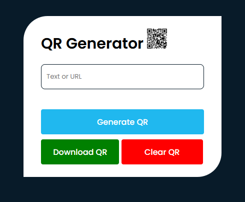

# 📱 QR Code Generator

A simple web application to generate QR codes from text or URLs.
## Preview

## ✨ Features

- Generate QR codes from text or URLs.
- Download the generated QR code image.
- Clear input and QR code image.

## 🛠️ Technologies Used

- HTML
- CSS
- JavaScript
## Hosted Link
Explore the project: https://souvik0216j.github.io/QR-Code-Generator/
